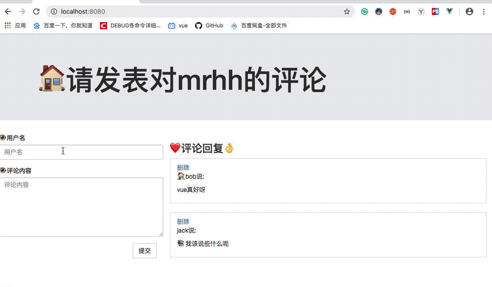

# 简单的评论列表项目 
##功能展示

## 首先先把静态页面进行拆分 

+ 拆为 app父组件 comment子组件和commentlist子组件 还有commentlist的孙组件 
它的父亲是commentlist

+ 数据在哪个组件，更新数据的行为就应该定义在哪个组件
+ 在父组件app.vue中定义增加评论的方法，不是给自己用的，而是通过标签 :addcomment='addcomment' 
传递给自己家的儿子用的，也就是说自己组件定义的函数，不一定是给自己用的

+ add()方法要考虑的问题 add方法是在comment组件上的 在add方法中调用addcomment方法
也就是在儿子的方法中调用父亲的方法 有点回调函数的意思
1. 检查输入法的合法性
2. 根据输入的数据，封装成一个comment对象
3. 添加到父组件的comments中，
4. 清除comment组件中双向绑定的username 和comment

+ delete方法在listitem中定义 在孙组件定义 然后在孙组件定义的方法中调用爷爷组件
也就是app.vue的方法 通过标签隔代传函数，真累阿 
window.confirm()方法的使用，弹窗效果，如果点确定，就执行里面的函数，因为要用到index，
所以要从listitem的父亲那里拿到index 通过标签:index='index'来传给儿子，儿子用props来
接收 然后直接使用即可
+ 关于  const{comment,index,delecomment} = this //结构赋值的思想 
+ 我觉得这里用了解构赋值的思想